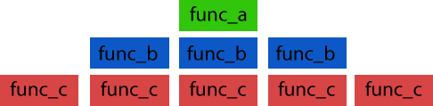
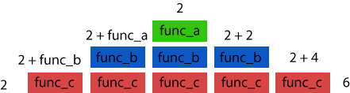

# Stacks

## 1. Introduction
   A basic structure in programming is the stack. A stack is a structure that is characterized by how the information is stored. We will discuss what a stack is and how to use it.
## 2. What is a stack?
   A stack is a data structure that is characterized by its last in/first out storage of items. We can think of a stack like a stack of pancakes, or cards, or really anything that is stacked. You place an item on top, and that is the next item that can be removed. So a stack is a structure that elements are added and removed from the end only.
      
## 3. How do we use stacks?
   A stack is used when we have a list of items of information that we want to store and access. In Python we add information to the stack with append(), and we remove information from the stack with pop().
   
   For example:

   Our stack will be a list of types of vehicle

   `stack = ['car', 'truck', 'van']`

   We can add vehicles to our stack with push()
   
   `stack.append('bus')`
   
   "stack" now returns ['car', 'truck', 'van', 'bus']

   notice that bus is at the end of the list
   
   We can remove those items from the stack with pop()
   
   `removed = stack.pop()`

   "stack" is now ['car', 'truck', 'van'] again and we have a new variable which is 'removed' which returns 'bus'

## 4. The function stack
   In Python, when we call a function, the interpreter will run it from top to bottom. This is how programs run, the interpreter will run the functions in a specific order.  This creates a call stack. As we traverse the call stack we might call additional functions, which might in turn call additional functions. As each function is called, it is added to the stack, then removed as it resolves. This is why we call it the function stack. We can use this feature of programming to debug our programs, as if a function returns an error, it will be the last function in the stack.  By examining the stack we can see where we went wrong, as the error will be thrown with the most recent function at the top of the stack.

   Consider the following code:
   ```
      def func_a(a):
         return a

      def func_b(b):
         b += func_a(b)
         return b

      def func_c(c):
         c += func_b(c)
         return c

      print(func_c(2))
   ```

   This returns 6. But have you thought of what is happening here?  Here is a visual representation:

   

   This represents the progression of the stack created by the program above over time. Remember a function doesn't resolve until it is told to do so, and each function is running the previous function before resolution, so basically what is happening is each function is being added to the stack until it resolves or returns a value.

   

   If you're still confused, here are the returns for each function as the stack progresses.


## 5. Analyzing stacks
   We can use the knowledge that a program will be executed as a stack, we can analyze the possible return values and behaviors of the program. As we review code, we want to know how the interpreter will prioritize the different parts. We can do this by creating diagrams that will give a visual representation of how the code is executed.  This can be done using a variety of different types of charts, but most commonly we can create a flow chart or a Unified Modeling Language Model, as well as a call tree.  The type of tool used to diagram a program depends on the complexity of the program, but all three can be very helpful.

## 6. Challenge:

   You'll be given the code for an adding machine, the problem is that it cannot correct errors when an incorrect number is added. Create undo and redo functions.

   [Challenge](./examples/stack_example.py)
   [Solution](./examples/stack_solution.py)
