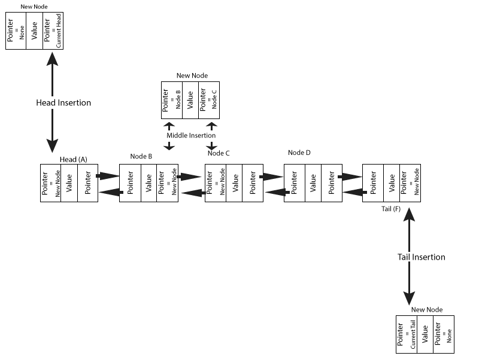

#Linked Lists

## 1. Introduction
 A linked list is a data structure that can store elements outside of contiguous memory. As opposed to more strict structures such as a dynamic array, which inserts and removes elements from adjacent memory locations.

 


## 2. Structure
Linked lists are defined by their **head** and all following elements linked by information called a pointer. The pointer indicates the next **node** in the list. Each node contains the value of the element, as well as the pointer indicating the next node.

 

 A linked list that can be traversed in both directions is called a doubly-linked list. This list has a tail in addition to the head. The node has two pointers, one indicating the previous node, and another indicating the next.

 

 The final node will always point to `None` as it's next node, and the head will have a "previous" pointer pointing to `None` in a doubly-linked list.

## 3. Benefits
 Since linked lists are not stored in contiguous memory they are ideal candidates as structures that receive and deploy elements frequently.  As we will see later, a linked list can be updated in O(1) at the head or the tail, though insertion to the middle of the list will require O(n). This usually occurs faster in a linked list because, although middle insertion requires iteration, the list does not have to shift to new locations in memory.
 Linked lists also use memory efficiently, since there is no need to use contiguous locations in memory.
#### Disadvantages
  A disadvantage of a linked list over other data structures is the inability to access specific locations without iteration. This makes searching a linked list slower than a dynamic array.

## 4. Insertion
  As noted before, one of the benefits of a linked list is the ability to add or remove nodes without changing the entire list. When adding an element to a linked list, only the adjacent nodes are affected, in fact, only adjacent nodes even need to know the new node exists.

  To insert an element into a linked list we first create the node, then modify the adjacent nodes to accept it.

  ### A. Inserting at the head
  To insert a node at the head two nodes need to be modified/created.  First we create the new node, setting the "next" pointer to point the current head node. In a doubly-linked list, we will also set the "previous" pointer to point to the new node we just created.

  ```
  def insert_head(list, node)
      if list.head is None:
            list.head = node
            self.tail = node
      else:
            node.next = list.head
            list.head.previous = node
            list.head = node
  ```


  

  ### B. Inserting in the Middle
  Three nodes need to be modified/created in this scenario. 
  1. Create the new node.
  2. Set the "previous" pointer of the new node to point to the trailing node (B in the diagram above). 
  3. Set the "next" pointer to point to the following node (C in the diagram above).
  4. Set the "previous" pointer of the following node to point to the new node.
  5. Set the "next" pointer of the trailing node to point to the new node.
  
  ```
  #This is a hypothetical function. You would need to traverse the list to find node_1 and node_2.
  def insert_middle(list, node, node_1, node_2)
      if list.head is None:
            list.head = node
            self.tail = node
      else:
            node.previous = node_1
            node.next = node_2
            node_2.previous = node
            node_1.next = node
  ```

  ### C. Inserting at the Tail
  Inserting at the tail is similar to inserting at the head.
  1. Create the new node.
  2. Set the "previous" pointer on the new node to point to the to the tail.
  3. Set the "next" pointer on the current tail to point to the new node.
  _...The "next" pointer of the new node should be set to None_
  
  ```
  def insert_tail(list, node)
      if list.head is None:
            list.head = node
            self.tail = node
      else:
            node.previous = list.tail
            list.tail.next = node
            list.tail = node
  ```

## 5. Removal
  Removing an element from a linked list is actually much easier. You really only need to set all pointers pointing to the element to be removed either to `None`, or in the case of a middle removal, the following "previous" pointer needs to point to the previous node, and the trailing "next" pointer needs to point to the next node.
  ### A. Head Removal
  1. Set the new head's "previous" pointer to `None`.
     _...if you are working with a custom class linked list, you have probably created a "head" attribute.  This should be set to the new head._
     ```
     def remove_head(list)
            if list.head == list.tail or list.head is None:
                  list.head = None
                  list.tail = None
            else:
                  list.head.next.previous = None
                  list.head = list.head.next
     ```
  ### B. Tail Removal
  1. Set the "next" pointer for the new tail to `None`
     _...see note above and apply to "tail" attribute_
     
  ```
  def remove_tail(list)
     if list.head is not None and list.head is not list.tail:
            list.tail.previous.next = None
            list.tail = list.tail.previous
      else:
            list.head = None
            list.tail = None

  ```
  ### C. Middle Removal
  1. Set the following node's "previous" pointer to point to the trailing node.
  2. Set the trailing node's "next" pointer to point to the following node.
  

## 6. Traversing a linked list
  To access nodes in a linked list, the list has to be traversed through loops. Doubly-linked lists can be traversed from the head or the tail, while singly-linked lists can only be traversed moving forward from the head. To do this we loop through the list until we find a pointer that is set to `None`.
  
  ```
  def traverse_list(list)
      current = list.head
      while current is not None:
            yield current.data
            current = current.next
  ```


## 7. The Double Ended Queue
  A double ended queue or a deque, is a type of linked list that is built into Python by default. It is a class that allows us to use the benefits of a linked list without building our own custom class.
  
  ```
  import deque

  linked_list = deque()

  #You can now use the built in functions of deque to manipulate and access your deque
  ```

## 8. Challenge
  You'll be given a Directory class with everything you need to add, remove and more names from the directory. You will eed to implement a solution to prevent the addition of duplicate names.

  [Challenge](./examples/ll_example.py)
  [Solution](./examples/ll_solution.py)