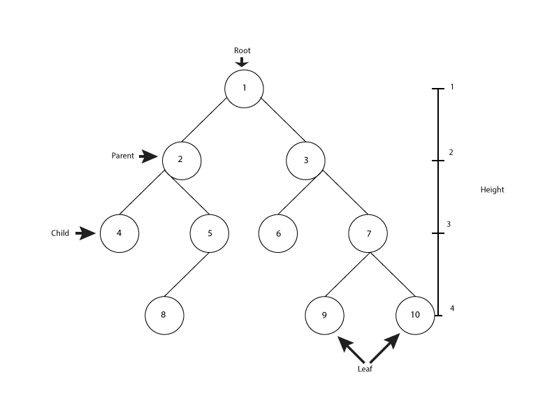
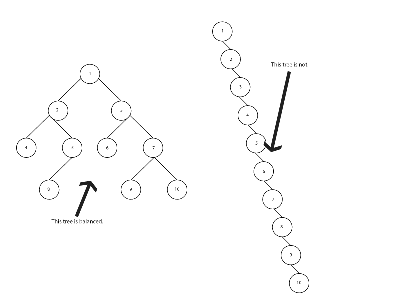
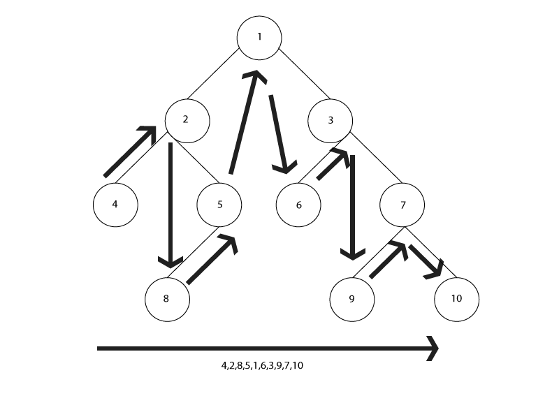
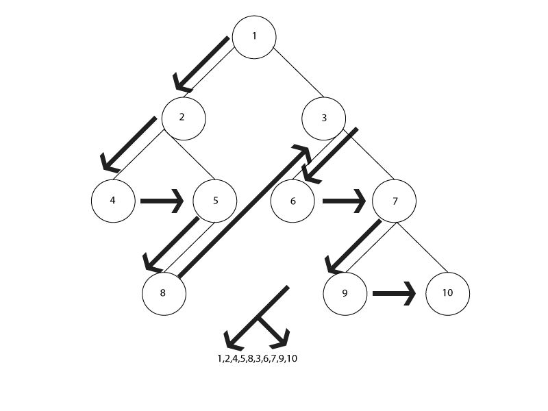
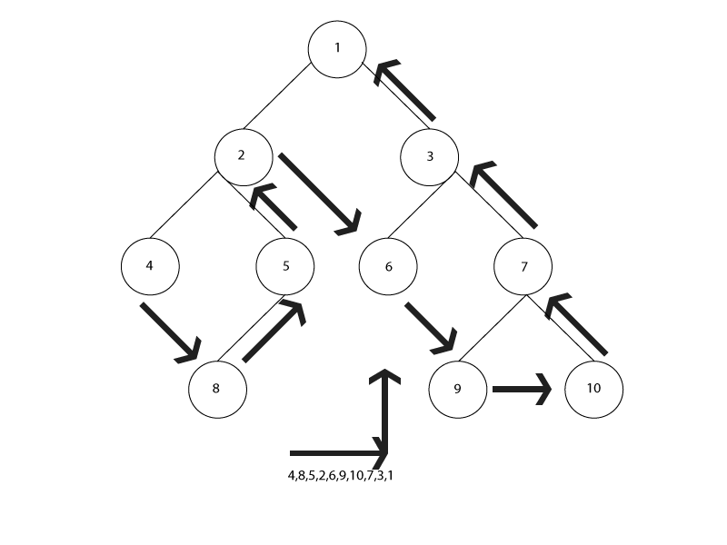

#Trees

## 1. Introduction
  Trees are a valuable structure in programming. They can be used for many purposes.
## 2. What is a Tree?
  A tree is a data structure that is much like a linked list, except that it is not linear. Each node can point to multiple nodes, which can make traversing a bit more complex. A tree consists of a **root node** and its children. Trees come in many forms, and they are dynamic, which allows them to grow or shrink freely. Each parent node can have many children. When the parent nodes have no more than two children we call it a binary tree.
  
## 3. Why is a Tree?
  We use trees when we have a use for heirarchical structure. This structure also helps reduce time complexity with increased data by eliminating linear structure.
## 4. Balancing Trees
  Trees are useful because they can reduce time complexity by decreasing the distance between any two nodes. This is only possible because the nodes are branched in both directions. What happens if the branches don't reach in both directions? We end up with a linked list. If the tree's height is equal to its size, we end up with the same problem we find in linear data. The solution to this is in balancing the tree.  We balance a tree by assuring that our child nodes branch out in both directions as often as possible. Instead of each parent connecting to one child only we optimize our data by branching two children from each parent, thus achieving balance. This balance has many advantages, among them quicker traversal.
  
## 5. Climbing Trees
  Much like a linked list, data can only be accessed from a tree by traversing that tree. Trees are not indexed, and therefore we must find our data the programatic way. To access the nodes of a tree we can traverse in three directions:
  * In-Order
  * Pre-order
  * Post-order
  #### A. In-Order
  In this process the tree is traversed by visiting the nodes from left to right. The left most node is visited virst, followed by its parent, then the next left-most node, then its parent, until we reach the root, at which time we continue on to the left-most node of the right-side subtree, then to its parent, and continue as we did on the left side until we reach the right-most node.
  
  #### B. Pre-Order
  This method visits the root first, then visits each node in the left subtree, then each in the right subtree.
  
  #### C. Post-Order
  Post-order traverses the tree from left to right then back to parents, so basically left to right, then bottom to top.
  
  We'll focus on traversal of a binary tree.
## 6. Example
  To traverse a binary tree we'll need to use recursion. The tree is created by defining the root node, then adding additional nodes as connected nodes, or children.
  This class will give us all the functionality we need to create a BST and traverse it using in-order, pre-order and post-order methods.

  We first create the constructor, which will initialize with no data unless provided. We will also set its pointers to None, as we have not added those nodes to the tree.
  ```
  class BST:
    def __init__(self, data=None):
        self.left = None
        self.right = None
        self.data = data
   ```
   We need to have a way to insert new nodes into the tree, so we will create a method that does that. Keep in mind we are building a balanced search tree, so we will need to insert each new node in the proper place, depending on current height and the value of the node.
   ```
    def insert(self, data):
        if not self.data:
            self.data = data
            return

        if self.data == data:
            return

        if data < self.data:
            if self.left:
                self.left.insert(data)
                return
            self.left = BST(data)
            return

        if self.right:
            self.right.insert(data)
            return
        self.right = BST(data)
   ```
   We can now traverse the tree.

   The preorder method will return a list of values as the tree is traversed. As we traverse the tree the route taken depends on the order of our if statements.
   ```
    def preorder(self, datas):
        if self.data is not None:
            datas.append(self.data)
        if self.left is not None:
            self.left.preorder(datas)
        if self.right is not None:
            self.right.preorder(datas)
        return datas
   ```
   ```
    def inorder(self, datas):
        if self.left is not None:
            self.left.inorder(datas)
        if self.data is not None:
            datas.append(self.data)
        if self.right is not None:
            self.right.inorder(datas)
        return datas
   ```
   ```
    def postorder(self, datas):
        if self.left is not None:
            self.left.postorder(datas)
        if self.right is not None:
            self.right.postorder(datas)
        if self.data is not None:
            datas.append(self.data)
        return datas
   ```

We can now build and print our tree to see each path of traversal.
```
bst = BST(27)
bst.insert(30)
bst.insert(38)
bst.insert(26)
bst.insert(72)

print(bst.preorder([]))
print(bst.inorder([]))
print(bst.postorder([]))
```

## 7. Challenge
Using the class above, find the min and the max values of the tree.

[The challenge can be found here.](./examples/tree_example.py)
[The solution can be found here.](./examples/tree_solution.py)